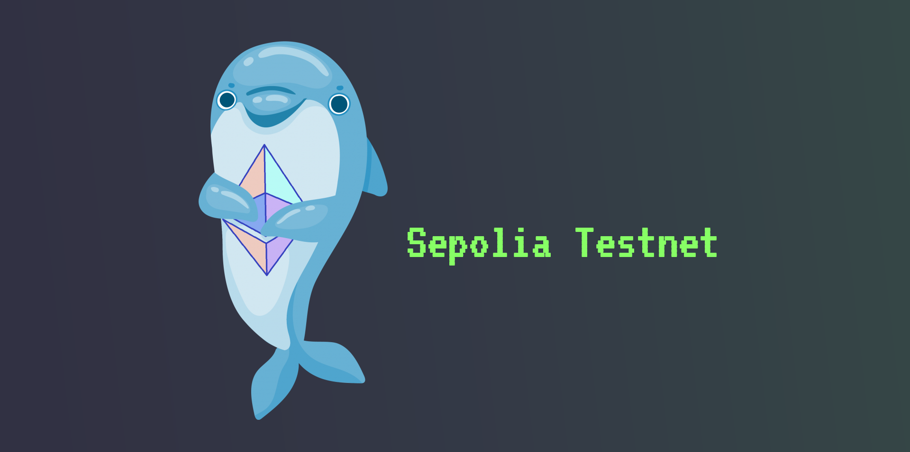
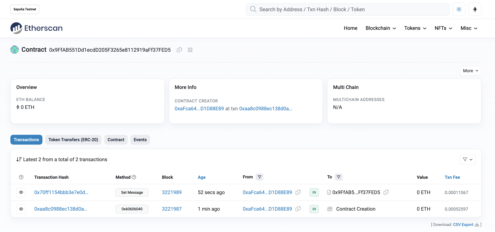

# Inbox Smart Contract Example

**Technologies:** _Ganache | Truffle | Web3.js | Solc Solidity Compiler | Mocha | Metamask | Infura SDK | Node | Ethereum Sepolia Testnet_

**Tutorial:** [Udemy Ethereum and Solidity: The Complete Developer's Guide](https://www.udemy.com/course/ethereum-and-solidity-the-complete-developers-guide/)

**Note:** .env file contains the following:

- INFURA_API_SEPOLIA_LINK
- MNEMONIC

**To Initialize:**

1. `git clone`
2. `npm install`
3. Setup [Metamask Wallet Chrome extension](https://chrome.google.com/webstore/detail/metamask/nkbihfbeogaeaoehlefnkodbefgpgknn?hl=en) and [Infura API key](https://www.infura.io/?utm_source=google&utm_medium=paidsearch&utm_campaign=Infura-Search-US-Brand-PHR&utm_term=infura%20web3&gclid=Cj0KCQjw8qmhBhClARIsANAtbodbKreSewaRy-Y2U8cWnP0IYJQpYCATESOLXZrC7c4mlok57yvoeDkaAouSEALw_wcB)
4. Configure .env file

**To Run:**

1. `node compile.js`
2. Run tests: `npm run test`
3. `node deploy.js`

**Deployed Smart Contract:**

